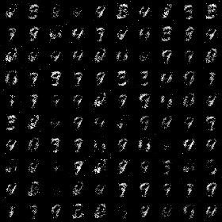
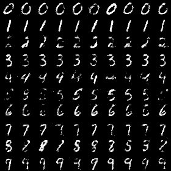
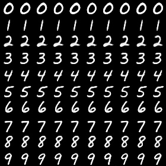

Pytorh implementation of [Conditional GAN](https://arxiv.org/abs/1411.1784) on [MNIST]([yann.lecun.com/exdb/mnist/](http://yann.lecun.com/exdb/mnist/)) dataset.

Both Generator and Discriminator are based on **MLP** sturcture.

## Dependencies:

[Pytorch](https://github.com/pytorch/pytorch) 1.0

[Matplotlib](https://matplotlib.org/) 

## How to run:

Directly check the CGAN.ipynb using [Jupyter notebook](<https://jupyter.org/>).

## Results

### 10 epochs

### 100 epochs

### 500 epochs

